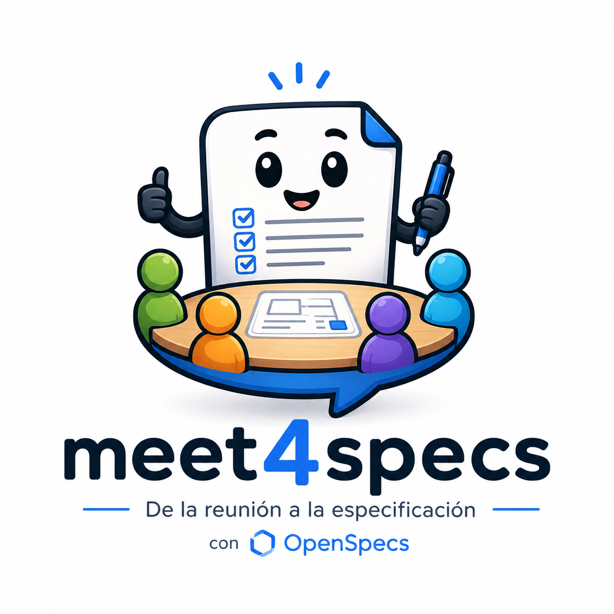
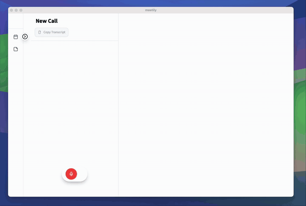
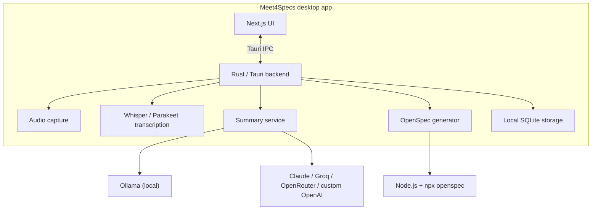
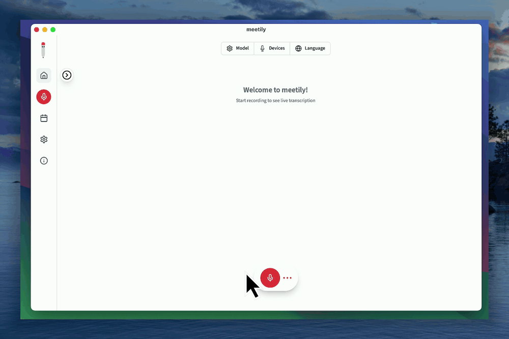
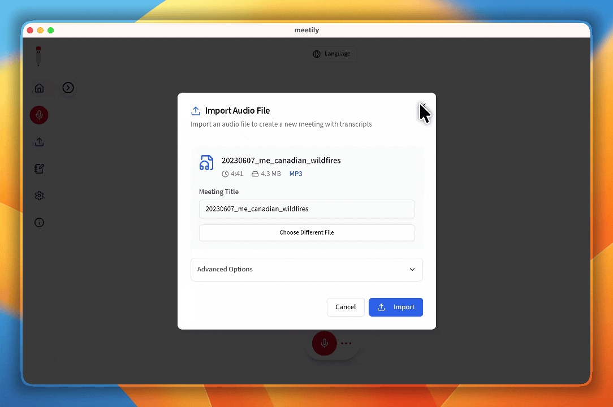

<div align="center">
  

# Meet4Specs

Turn user interviews into OpenSpec-ready development bundles — locally, privately, and with enough structure to move from conversation to implementation.

[](https://github.com/xmagcx/meet4specs/stargazers)
[](LICENSE.md)
[](https://github.com/xmagcx/meet4specs/actions)
[](https://github.com/xmagcx/meet4specs/commits)
[](https://github.com/xmagcx/meet4specs)
</div>

## Quick Demo

<div align="center">
  
</div>

## Project Description

**Meet4Specs** is a local-first desktop application for product discovery and spec-driven delivery. It records user interviews, transcribes them on-device, generates AI summaries, and turns those conversations into OpenSpec bundles (`proposal`, `spec`, `design`, `tasks`) that development teams can actually use.

It builds on top of [Meetily](https://github.com/Zackriya-Solutions/meeting-minutes), reoriented from generic meeting intelligence toward requirements capture and specification generation.

## Why This Project?

Most interview notes die in chat threads, docs, or scattered recordings. Teams lose context between discovery and delivery, then rewrite the same intent again when engineering starts.

Meet4Specs closes that gap. Instead of stopping at transcript or summary, it pushes one step further: interview → structured requirements → OpenSpec-ready artifact bundle. You keep privacy-first local transcription, but get output shaped for real product and engineering workflows.

## Key Features

| Feature | Description |
| --- | --- |
| Local-first transcription | Captures microphone + system audio, then transcribes interviews locally with Whisper or Parakeet models. |
| OpenSpec bundle generation | Produces structured `proposal`, `spec`, `design`, and `tasks` outputs from interview content. |
| Flexible AI providers | Supports fully local Ollama plus Claude, Groq, OpenRouter, and custom OpenAI-compatible endpoints. |
| Cross-platform desktop app | Built with Tauri for macOS, Windows, and Linux. |
| GPU-aware transcription | Uses Metal/CoreML, CUDA, Vulkan, HIP, or OpenBLAS depending on platform and hardware. |
| Downloadable deliverables | Exports generated specs as a `.zip` bundle ready for review or handoff. |
| Privacy-preserving workflow | Audio, transcripts, and local processing stay on your machine unless you explicitly choose a cloud model provider. |

## Technology Stack

Primary stack, sourced from project manifests and setup docs:

- **Desktop shell:** Tauri `2.6.x`
- **Backend:** Rust `edition 2021`, minimum Rust `1.77`
- **Frontend:** Next.js `14`, React `18`, TypeScript `5`
- **UI:** Tailwind CSS, shadcn/ui, Radix UI
- **Local database:** SQLite via `sqlx`
- **Transcription engines:** `whisper-rs 0.16.0`, Parakeet via ONNX Runtime
- **Local AI option:** Ollama
- **Build tooling:** Node.js LTS `>= 18`, pnpm `>= 8`, Bun `>= 1.1.43`, CMake `>= 3.x`

## Project Architecture

Meet4Specs is a self-contained desktop application.



High level:
- **Next.js frontend** drives interview, transcript, and settings UX.
- **Rust/Tauri backend** handles native audio capture, transcription, local storage, summaries, and OpenSpec generation.
- **Node.js + OpenSpec CLI** are used when generating the development-spec bundle.

See also [docs/architecture.md](docs/architecture.md) and [docs/DEV_SETUP.md](docs/DEV_SETUP.md).

## Getting Started

### Prerequisites

- **End users:** supported desktop OS and microphone
- **Spec generation:** Node.js LTS installed on PATH
- **From source:** Node.js, pnpm, Rust, Bun, CMake

### Quick Start from source

```bash
git clone git@github.com:xmagcx/meet4specs.git
cd meet4specs/frontend
pnpm install
./dev-gpu.sh
```

CPU-only alternative:

```bash
cd frontend
pnpm tauri:dev
```

### First-run flow

1. Open app and complete onboarding.
2. Download transcription model.
3. Configure AI provider in Settings.
4. Record interview or import audio.
5. Generate summary.
6. Click **Generate development specification**.

For OS-specific install and troubleshooting, see [docs/GETTING_STARTED.md](docs/GETTING_STARTED.md) and [docs/BUILDING.md](docs/BUILDING.md).

## Usage

Typical workflow:

1. Run an interview in Meet4Specs.
2. Capture microphone and optional system audio.
3. Review transcript and summary.
4. Export generated OpenSpec bundle.

Example of inspecting exported output:

```bash
unzip customer-discovery-spec.zip -d ./customer-discovery-spec
find ./customer-discovery-spec -maxdepth 3 -type f | sort
```

Expected bundle shape:

```text
customer-discovery-spec/
├── proposal.md
├── design.md
├── tasks.md
└── specs/
    └── <capability>/
        └── spec.md
```

That output is designed to plug into a spec-driven development workflow instead of forcing teams to manually rewrite interview notes into engineering artifacts.

### Product demos

<div align="center">
  
</div>

<div align="center">
  
</div>

## Project Structure

| Path | Purpose |
| --- | --- |
| `frontend/` | Next.js desktop UI, scripts, and frontend tests |
| `frontend/src-tauri/` | Rust/Tauri core: audio, transcription, storage, summaries, OpenSpec generation |
| `llama-helper/` | Rust sidecar binary for local inference support |
| `docs/` | End-user, build, architecture, and setup documentation |
| `openspec/` | Local OpenSpec workspace for specs and in-flight changes |
| `backend/` | Legacy backend archive retained for historical context, not current supported path |
| `assets/` | Branding and visual assets |

## Development Workflow

Current repo workflow, based on `CONTRIBUTING.md` and GitHub Actions docs:

- `main` = production branch
- `devtest` = integration and testing branch
- Feature branches should branch from `devtest`
- Pull requests target `devtest`
- CI provides multi-platform build/test validation plus release automation

Useful workflow docs:
- [Contributing guide](CONTRIBUTING.md)
- [.github/workflows/WORKFLOWS_OVERVIEW.md](.github/workflows/WORKFLOWS_OVERVIEW.md)
- [.github/workflows/README_DEVTEST.md](.github/workflows/README_DEVTEST.md)

## Coding Standards

Project conventions documented in `CONTRIBUTING.md`:

- follow existing code style
- use meaningful variable and function names
- keep functions small and focused
- add comments for complex logic
- update docs when behavior changes
- use structured commit messages such as `feat(scope): subject`

## Testing

Testing is mixed by layer:

- **Frontend:** tests live under `frontend/tests/`
- **Rust backend:** extensive unit and async tests live under `frontend/src-tauri/src/`
- **CI:** GitHub Actions validates cross-platform builds and release flow

Contributor expectation:
- add or update tests for new behavior
- ensure relevant tests pass before PR
- update docs when feature behavior changes

## Roadmap

Current direction, based on existing docs and repo intent:

- [ ] Improve interview-to-spec prompt quality and artifact fidelity
- [ ] Expand OpenSpec generation workflows for more business discovery patterns
- [ ] Refine import and post-processing flows for recorded interviews
- [ ] Continue hardening cross-platform audio and GPU acceleration support

## FAQ

### Does audio leave my machine?
Transcription can run fully locally. Summaries and spec generation stay local if you use Ollama; cloud providers are optional.

### Do I need Node.js?
Only for the **Generate development specification** feature, which invokes the OpenSpec CLI via `npx`.

### Is the old `backend/` folder still supported?
No. It is retained for historical reference. Current supported architecture is the Tauri desktop app.

## Contributing

Contributions welcome. Best path:

1. Open or confirm issue first.
2. Branch from `devtest`.
3. Keep change focused.
4. Add or update tests.
5. Open PR against `devtest` and complete template.

For details, read [CONTRIBUTING.md](CONTRIBUTING.md). If the repo starts labeling onboarding issues, `good first issue` is best place to begin.

## Author & Contact

**Mauricio Gallardo**

[](mailto:mauricio.gallardo@outlook.com)
[](https://www.linkedin.com/in/mauricio-gallardo-carvacho/)

## License

Distributed under the MIT License. See [LICENSE.md](LICENSE.md).

## Star History

<a href="https://www.star-history.com/?repos=xmagcx%2Fmeet4specs&type=timeline&legend=top-left">
 <picture>
   <source media="(prefers-color-scheme: dark)" srcset="https://api.star-history.com/chart?repos=xmagcx/meet4specs&type=timeline&theme=dark&legend=top-left&sealed_token=J_owx_Mu6OFOrn_vnQ7iZgZltLvypow-jKsxPrKSRwgwgoAqa4f918ezt-LtAaKCavUdT3R536tR2uHpEaJ7xidxyhO9cKOMBkVH6M7d--wA-SY5O4vVNg" />
   <source media="(prefers-color-scheme: light)" srcset="https://api.star-history.com/chart?repos=xmagcx/meet4specs&type=timeline&legend=top-left&sealed_token=J_owx_Mu6OFOrn_vnQ7iZgZltLvypow-jKsxPrKSRwgwgoAqa4f918ezt-LtAaKCavUdT3R536tR2uHpEaJ7xidxyhO9cKOMBkVH6M7d--wA-SY5O4vVNg" />
   
 </picture>
</a>