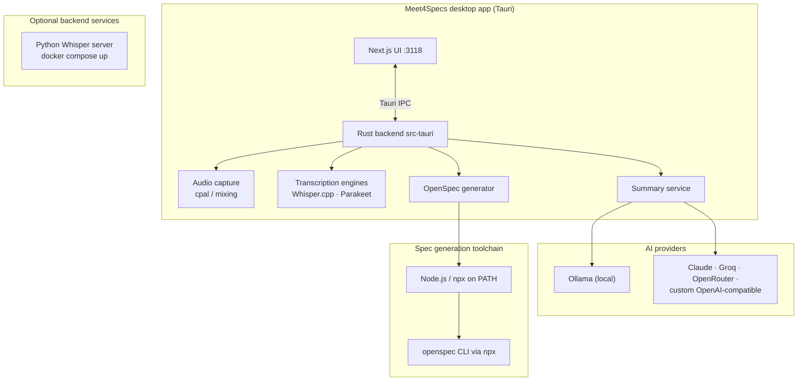

# Meet4Specs — Developer Setup

> **Meet4Specs** is a fork of [**Meetily**](https://github.com/Zackriya-Solutions/meeting-minutes) by [Zackriya Solutions](https://github.com/Zackriya-Solutions) (MIT License), repurposed to generate development specifications (OpenSpec bundles) from user interviews. All upstream credits belong to the Meetily team and contributors.

This guide covers everything you need to build and run the project from source on **Windows** and **Linux**. The prerequisite lists below are not generic — every item was validated against real build failures hit during development.

---

## Repository map

| Path | What it is |
|---|---|
| `frontend/` | Next.js 14 (App Router) + TypeScript + Tailwind + shadcn/ui UI, served on port **3118**. Package manager: **pnpm** |
| `frontend/src-tauri/` | Rust/Tauri backend: audio capture, transcription engines (Whisper.cpp / Parakeet), summary providers, OpenSpec generator |
| `llama-helper/` | Rust sidecar binary for local LLM inference (Tauri `externalBin` — must exist at build time) |
| `backend/` | Python Whisper server, Docker files (`docker-compose.yml`), build scripts for whisper.cpp, Windows dependency installer |
| `docs/` | You are here — plus [BUILDING.md](BUILDING.md), [building_in_linux.md](building_in_linux.md), [GPU_ACCELERATION.md](GPU_ACCELERATION.md) |

## Architecture



---

## Prerequisites (all operating systems)

| Tool | Version | Used for |
|---|---|---|
| Git | latest | Source control; Cargo git dependencies |
| Node.js | LTS ≥ 18 | Next.js frontend; OpenSpec CLI via `npx` |
| pnpm | ≥ 8 | Frontend package manager |
| Rust (rustup) | stable | Tauri backend, llama-helper sidecar |
| Bun | ≥ 1.1.43 | Whisper build scripts / backend tooling |
| CMake | ≥ 3.x | whisper.cpp compilation |

## 🪟 Windows prerequisites

Validated against `backend/install_dependancies_for_windows.ps1`. If you prefer, just run that script as Administrator — it installs all of the below automatically.

| Requirement | Why it's needed |
|---|---|
| **Visual Studio 2022 Build Tools** with workload components:<br>• `Microsoft.VisualStudio.Component.VC.Tools.x86.x64`<br>• `Microsoft.VisualStudio.Component.Windows11SDK.22000` | MSVC linker + Windows SDK. **The #1 blocker**: without it every Rust crate fails at link time (`link.exe` not found) |
| VC++ Redistributables | Runtime libraries for compiled binaries |
| Chocolatey | Package manager used by the automated installer |
| CMake (added to PATH) | whisper.cpp build |
| Python 3.11 + pip | Backend Whisper server |
| Git | Standard |
| Bun ≥ 1.1.43 | Backend build scripts |
| **LunarG Vulkan SDK** *(optional)* | Only needed when you explicitly want Vulkan acceleration on Windows. It provides the `VULKAN_SDK` environment variable used by `whisper-rs-sys`. |

Manual install of the Build Tools workload:

```powershell
choco install visualstudio2022buildtools -y --package-parameters `
  "--add Microsoft.VisualStudio.Component.VC.Tools.x86.x64 `
   --add Microsoft.VisualStudio.Component.Windows11SDK.22000"
```

> After installing Build Tools for the first time, open a **new** terminal (or a *Developer Command Prompt*) so the MSVC environment variables are picked up.
>
> Windows build behavior: `frontend/build.bat` now uses the repo's auto-detection path by default. If `VULKAN_SDK` is missing, it falls back to non-Vulkan build modes instead of forcing a failing Vulkan build.
>
> Local production builds also skip updater artifact signing when `TAURI_SIGNING_PRIVATE_KEY` is not set by merging `src-tauri/tauri.local.conf.json`. Release builds that need updater artifacts must provide the private key.

## 🐧 Linux prerequisites (Ubuntu 22.04 — validated)

These packages were each confirmed necessary by an actual build failure:

| Missing package | Real error it caused | Crate affected |
|---|---|---|
| `libgtk-3-dev` | `gdk-3.0` system library not found during `cargo check` | Tauri / GTK bindings |
| `libwebkit2gtk-4.1-dev` | Required by Tauri v2 on Linux (companion to the above) | wry / webkit |
| `libasound2-dev` | `pkg-config --libs --cflags alsa` failed — no `alsa.pc` | `alsa-sys` (via `cpal`, audio capture) |
| `libclang-dev` | bindgen panicked: no shared `libclang.so` at build time | `whisper-rs-sys` |

One-liner:

```bash
sudo apt update
sudo apt install -y \
  build-essential cmake git curl wget file pkg-config \
  libgtk-3-dev libwebkit2gtk-4.1-dev \
  libasound2-dev libclang-dev
```

Depending on your desktop environment, Tauri's standard dependency list may also pull in `libssl-dev`, `libayatana-appindicator3-dev`, `librsvg2-dev` and `libxdo-dev` — install them if the build asks.

### Known Linux gotchas (real incidents)

- **Cargo can't fetch `ffmpeg-sidecar`**: if your global git config rewrites `https://github.com/` URLs to SSH, add this to `frontend/src-tauri/.cargo/config.toml`:
  ```toml
  [net]
  git-fetch-with-cli = true
  ```
- **Stale `ffmpeg-sidecar` pin**: if fetching still fails after the above, refresh the lockfile entry (`cargo update -p ffmpeg-sidecar` inside `frontend/src-tauri`).
- **NVIDIA + Wayland rendering/input issues**: one incident of unresponsive clicks was traced to WebKitGTK's DMA-BUF renderer on that combination. Try an X11 session or `WEBKIT_DISABLE_DMABUF_RENDERER=1` before assuming a code bug.
- **Port 3118 already in use**: a stale `next dev` instance — kill it before starting another session.

## Setup steps

```bash
# 1. Clone
git clone https://github.com/<your-org>/meet4specs.git
cd meet4specs/frontend

# 2. Install frontend dependencies
pnpm install

# 3a. Run in development mode
./dev-gpu.sh          # Linux/macOS (auto-detects GPU acceleration)
pnpm tauri:dev        # explicit CPU mode alternative
```

```bat
:: 3b. Windows development / local production build
build.bat debug       :: auto-detects acceleration; does NOT require Vulkan SDK
build.bat             :: local production build; skips updater signing if TAURI_SIGNING_PRIVATE_KEY is missing
```

```powershell
# 3c. Signed Windows release build (updater artifacts enabled)
$env:TAURI_SIGNING_PRIVATE_KEY = Get-Content .tauri\meetily.key -Raw
$env:TAURI_SIGNING_PRIVATE_KEY_PASSWORD = "<password>"
./build.ps1
```

```bash
# 4. Production build (Linux/macOS)
./build-gpu.sh
```

What `dev-gpu.sh` / `build-gpu.sh` do automatically: detect GPU → build the `llama-helper` sidecar → copy it into `src-tauri/binaries/` with the target triple → run `tauri dev/build` with the right feature flags (`cuda`, `hipblas`, `vulkan`, `openblas`, or none).

> The `llama-helper` sidecar **must exist** before `tauri dev`/`tauri build` because it is declared as a Tauri `externalBin`. The GPU scripts handle this for you; if you run raw `pnpm tauri:dev:cpu`, build the sidecar first from the workspace root.

### Optional: backend Whisper server via Docker

```bash
cd ../backend
docker compose up
```

See `backend/docker-compose.yml` and [backend/README.md](../backend/README.md) for CPU/GPU variants.

## GPU acceleration

- **Linux**: full auto-detection guide in [BUILDING.md](BUILDING.md) (CUDA / ROCm / Vulkan).
- **Windows/macOS**: see [GPU_ACCELERATION.md](GPU_ACCELERATION.md).

## More documentation

- [Building from source (all OS)](BUILDING.md)
- [Detailed Linux build guide](building_in_linux.md)
- [Getting Started (end users)](GETTING_STARTED.md)
- [Contributing guidelines](../CONTRIBUTING.md)
