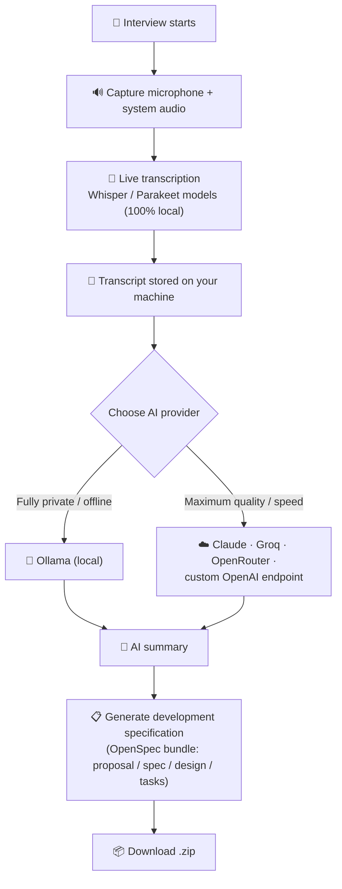

# Meet4Specs — Getting Started

> **Meet4Specs** turns your user interviews into actionable development specifications.
>
> This project is built on top of [**Meetily**](https://github.com/Zackriya-Solutions/meeting-minutes), the privacy-first AI meeting assistant by [Zackriya Solutions](https://github.com/Zackriya-Solutions) (MIT License). All credits for the underlying technology go to the Meetily team and its contributors.

---

## What is Meet4Specs?

Meet4Specs is a **local-first desktop app** that helps you capture user interviews and convert them into **development specifications you can actually use**:

1. 🎙️ Record your interview (microphone + system audio, e.g. Zoom/Meet/Teams calls).
2. 📝 Transcribe everything **locally** — no audio ever leaves your machine.
3. 🤖 Generate summaries and **development specification bundles** (proposal, spec, design, tasks — OpenSpec format) using **local AI (Ollama)** or an **external provider** (Claude, Groq, OpenRouter, custom OpenAI-compatible endpoints), depending on your privacy needs and scope.
4. 📦 Export the generated specification as a downloadable `.zip`.

Everything runs on your infrastructure. Your conversations are yours.

## How it works

## Requirements

### Hardware (any OS)

| Item | Minimum | Recommended |
|---|---|---|
| RAM | 8 GB | 16 GB |
| Free disk | ~5 GB | 10 GB+ (room for transcription models) |
| Microphone | Required | — |
| GPU | Not required (CPU mode works) | NVIDIA (CUDA) / AMD (ROCm) / Vulkan speeds up transcription |

Transcription models range from a few hundred MB to several GB and are downloaded from within the app.

### By operating system

| OS | Install method |
|---|---|
| 🪟 **Windows 10/11 (x64)** | Download `*-setup.exe` from [Releases](https://github.com/Zackriya-Solutions/meeting-minutes/releases/latest), run the installer |
| 🍎 **macOS (Apple Silicon)** | Download the `.dmg` from [Releases](https://github.com/Zackriya-Solutions/meeting-minutes/releases/latest), drag to Applications |
| 🐧 **Linux** | Build from source — see the [Developer Setup guide](DEV_SETUP.md) |

## First-run checklist

1. **Install and open Meet4Specs.**
   - *Windows*: if SmartScreen shows a warning for the unsigned installer, click *More info → Run anyway*.
2. **Complete the onboarding wizard**: pick and download a transcription model.
   - Whisper models cover many languages; Parakeet models are faster. Pick according to your interview language.
3. **Choose your AI provider** in Settings (see table below).
   - For a fully offline experience, install [Ollama](https://ollama.com/) and pull a model (e.g. `ollama pull llama3.1`).
4. **Select your audio devices**: pick your microphone, and enable system-audio capture if you attend calls through apps like Zoom, Meet or Teams.
5. **Grant permissions** (macOS mainly): microphone and accessibility/screen-capture permissions when prompted.
6. **Install Node.js (LTS)** — required only for the *"Generate development specification"* feature, which runs the OpenSpec CLI via `npx`. Get it at [nodejs.org](https://nodejs.org/). The app will warn you if Node is missing when you press the button.

## Choosing an AI provider

| Provider | Data leaves your machine? | Cost | Best for |
|---|---|---|---|
| **Ollama** (local) | ❌ Never | Free | Regulated environments, confidential interviews, offline work |
| **Claude** | ✅ Transcript goes to Anthropic API | API key | Highest-quality long-interview analysis |
| **Groq** | ✅ Transcript goes to Groq API | API key | Very fast summaries |
| **OpenRouter** | ✅ Transcript goes to OpenRouter | API key | One key, many models |
| **Custom OpenAI-compatible endpoint** | Depends on the endpoint | Varies | Self-hosted LLM gateways, enterprise infrastructure |

> Rule of thumb: sensitive client interviews → **Ollama**. Internal discovery sessions where quality matters more than locality → a cloud provider.

## Generating your first specification

1. Start a recording and conduct (or import) your interview. You can also import an existing audio file (*Import* is currently in Beta).
2. Stop the recording — the transcript appears live and is saved automatically.
3. *(Optional)* Generate an AI summary first to sanity-check the content.
4. Press **Generate development specification**. The app runs the OpenSpec CLI against the transcript and produces a structured bundle.
5. Download the `.zip`: you get `proposal`, `spec`, `design`, and `tasks` documents ready to feed into your spec-driven development workflow.

## Troubleshooting

| Symptom | Fix |
|---|---|
| No system audio captured (Windows/Linux) | Check device selection in Settings; some audio drivers expose separate loopback devices |
| "Node.js is required to run OpenSpec" | Install Node.js LTS from [nodejs.org](https://nodejs.org/), restart the app |
| Summary generation fails | Verify the provider: is Ollama running (`ollama serve`)? Is the API key valid? |
| Port 3118 already in use | A previous instance may still be running — close it or kill the process listening on 3118 |
| Linux (NVIDIA + Wayland): blank window or clicks not registering | Try an X11 session, or launch with `WEBKIT_DISABLE_DMABUF_RENDERER=1`. This has been observed only on specific driver combinations |

For build-from-source problems on Linux, see the [Developer Setup guide](DEV_SETUP.md).
