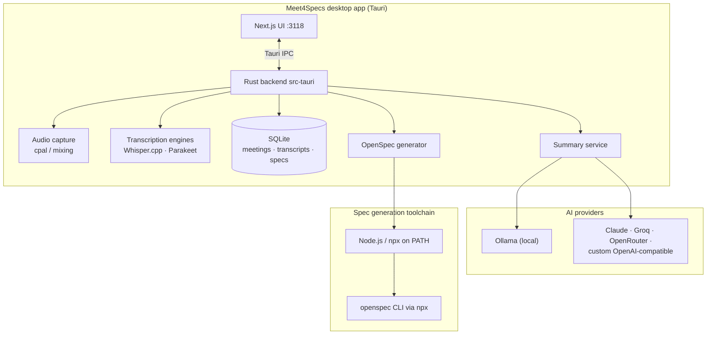

# System Architecture

**Meet4Specs** is a self-contained desktop application built with [Tauri](https://tauri.app/), forked from [Meetily](https://github.com/Zackriya-Solutions/meeting-minutes) and repurposed to generate **development specifications (OpenSpec bundles) from user interviews**. It combines a Rust-based backend with a Next.js frontend into a single, efficient, cross-platform application — with all AI processing available locally or through external providers, your choice.

## High-Level Architecture Diagram

## Component Details

### Frontend (Next.js)

*   Provides the user interface for managing meetings, displaying transcriptions, reviewing generated specifications, and configuring the application. Served locally on port **3118** (package manager: pnpm).
*   Communicates with the Rust core exclusively through Tauri's command system (IPC) — no HTTP server exposed to the network.

### Backend (Rust Core)

*   **Tauri Core:** The heart of the application, responsible for managing the window, handling events, and exposing the Rust core to the frontend.
*   **Audio Engine:** Captures audio from the microphone and system (`cpal`), processes and mixes it, and prepares it for transcription.
*   **Transcription Engine:** Uses local speech-to-text models (**Whisper.cpp** or **Parakeet**) to transcribe the captured audio. GPU-accelerable (CUDA / ROCm / Vulkan / Metal).
*   **Database:** A local SQLite database storing meetings, transcripts, summaries and generated specification artifacts.
*   **Summary Engine:** Generates meeting summaries and structured notes through pluggable LLM providers: **Ollama** (fully local, private) or cloud providers (**Claude**, **Groq**, **OpenRouter**, any custom OpenAI-compatible endpoint).
*   **llama-helper sidecar:** A separate Rust binary for local LLM inference, declared as a Tauri `externalBin`. It must be compiled before `tauri dev`/`tauri build` (the GPU scripts handle this automatically — see [DEV_SETUP.md](DEV_SETUP.md)).
*   **OpenSpec Generator:** The core differentiator of this fork. Takes an interview transcript and drives the [`openspec`](https://openspec.dev) CLI (via `npx`) to produce a validated development-specification bundle the team can hand to implementers. This is why **Node.js LTS must be on PATH even for end users**, not just developers.

### External Runtime Dependencies

| Dependency | Required by | Scope |
|---|---|---|
| Node.js ≥ 18 (`npx`) | OpenSpec generator | End users *and* developers |
| Ollama or an LLM API key | Summary engine | End users (choose one) |
| Python Whisper server (optional) | Alternative cloud-free transcription | End users (optional, via `backend/docker-compose.yml`) |

## Data Flow (interview → specification)

1.  Audio is captured locally and transcribed on-device (Whisper/Parakeet) — no audio leaves the machine unless you opt into a cloud transcription provider.
2.  The transcript is enriched into structured notes by the selected LLM provider.
3.  The OpenSpec generator turns those notes into development specifications and packages them as a downloadable bundle.

## Related Documentation

*   [Developer Setup](DEV_SETUP.md) — prerequisites per OS (validated against real build failures), repo map, known gotchas
*   [Building from Source](BUILDING.md) — detailed build guide incl. output locations and Windows VS2022 requirements
*   [GPU Acceleration](GPU_ACCELERATION.md) — CUDA / ROCm / Vulkan setup
*   [Getting Started (end users)](GETTING_STARTED.md)
